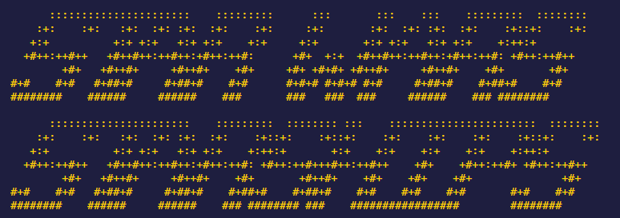

<center>



</center>

<p align="center">
 
 
 
</p>
<div align="center">
   <h1>Star Wars Starships</h1>
This CLI tool calculates MGLT measurements, used in the Star Wars franchise!

</br>
</div>

## Instalação:

I'm assuming you have [Git](https://git-scm.com/) and [NodeJS](https://nodejs.org/en/) in your system.

I used pnpm in this project, so type: (if you don't have it installed)

```bash
npm install -g pnpm
```

Code download:

```bash
 git clone https://github.com/pedroperegrinaa/technical-test-swapi.git
```

Download modules:

```bash
pnpm install
```
## CLI

Você pode usar este programa da seguinte forma:

```bash
sucrase-node src/index.ts distance 1000000
```

This is the expected return:

```bash

      ::::::::::::::::::::::    :::::::::      :::       :::    :::    :::::::::  :::::::: 
    :+:    :+:   :+:  :+: :+:  :+:    :+:     :+:       :+:  :+: :+:  :+:    :+::+:    :+: 
   +:+          +:+ +:+   +:+ +:+    +:+     +:+       +:+ +:+   +:+ +:+    +:++:+         
  +#++:++#++   +#++#++:++#++:+#++:++#:      +#+  +:+  +#++#++:++#++:+#++:++#: +#++:++#++   
        +#+   +#++#+     +#++#+    +#+     +#+ +#+#+ +#++#+     +#++#+    +#+       +#+    
#+#    #+#   #+##+#     #+##+#    #+#      #+#+# #+#+# #+#     #+##+#    #+##+#    #+#     
########    ######     ######    ###       ###   ###  ###     ######    ### ########    
   
      ::::::::::::::::::::::    :::::::::  :::::::: :::    :::::::::::::::::::::::  :::::::: 
    :+:    :+:   :+:  :+: :+:  :+:    :+::+:    :+::+:    :+:    :+:    :+:    :+::+:    :+: 
   +:+          +:+ +:+   +:+ +:+    +:++:+       +:+    +:+    +:+    +:+    +:++:+         
  +#++:++#++   +#++#++:++#++:+#++:++#: +#++:++#+++#++:++#++    +#+    +#++:++#+ +#++:++#++   
        +#+   +#++#+     +#++#+    +#+       +#++#+    +#+    +#+    +#+              +#+    
#+#    #+#   #+##+#     #+##+#    #+##+#    #+##+#    #+#    #+#    #+#       #+#    #+#     
########    ######     ######    ### ######## ###    #################        ########       

🚀 Starship: CR90 corvette
⌛ Time: 1 year
⛽ Ressuplies: 1 

🚀 Starship: Star Destroyer
⌛ Time: 2 years
⛽ Ressuplies: 0 

🚀 Starship: Sentinel-class landing craft
⌛ Time: 1 month
⛽ Ressuplies: 19 

```